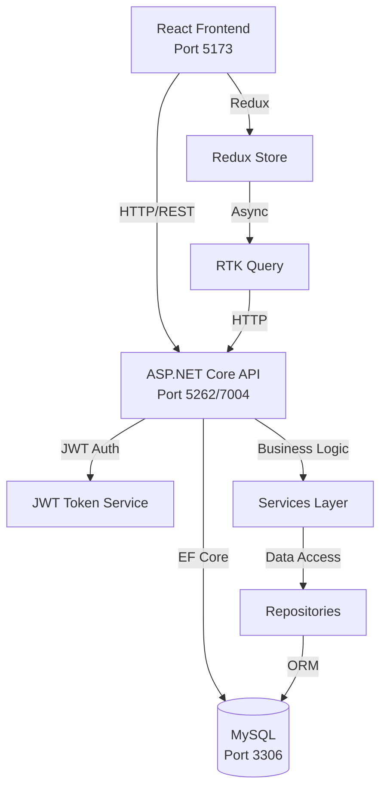

<!-- generated-by: gsd-doc-writer -->
# Architecture

## System Overview

IPC Management System is a full-stack web application for managing industrial and production catering operations. It handles the complete workflow from weekly menu planning, ingredient demand calculation, purchase approvals, supplier quotations, warehouse inventory, and production tracking. The system follows a layered architecture with a React frontend communicating with a .NET Core Web API backend, backed by MySQL database.

## Component Diagram



## Backend Architecture

### Controllers (API Layer)
The API exposes 23 controllers organized by domain:

| Controller | Purpose |
|------------|---------|
| `AuthController` | Authentication, login, logout, profile |
| `AdminEmployeesController` | Employee/role management |
| `CoordinationController` | Coordination operations |
| `DishesController` | Dish/menu catalog management |
| `IngredientsController` | Raw material/ingredient catalog |
| `MaterialDemandController` | Material demand generation |
| `PurchaseRequestsController` | Purchase request workflow |
| `PurchaseOrdersController` | Purchase order management |
| `PurchaseWorkflowController` | Purchase approval workflow |
| `SupplierQuotationsController` | Supplier quotation handling |
| `SuppliersController` | Supplier master data |
| `ApprovalRulesController` | Approval rule configuration |
| `ApprovalsController` | Approval execution |
| `ApprovalHistoryController` | Approval audit trail |
| `WarehousesController` | Warehouse management |
| `InventoryReceiptsController` | Goods receipt |
| `InventoryIssuesController` | Goods issue |
| `InventoryReturnsController` | Inventory returns |
| `StocktakesController` | Stocktake operations |
| `ProductionPlansController` | Production planning |
| `WorkflowReportsController` | Reporting |
| `SampleDataController` | Demo data import |
| `SupplementalMaterialRequestsController` | Supplemental requests |

### Services Layer
Business logic implemented in 16 service classes following the repository pattern:

| Service | Responsibility |
|---------|----------------|
| `AuthService` | JWT token generation, refresh token rotation |
| `CoordinationService` | Coordination business logic |
| `DishService` | Dish/BOM management |
| `IngredientService` | Material management |
| `SupplierService` | Supplier operations |
| `SupplierQuotationService` | Quotation handling |
| `ProductionPlanService` | Production planning |
| `StockLedgerService` | Inventory ledger tracking |
| `StocktakeService` | Stocktake operations |
| `WarehouseService` | Warehouse operations |
| `InventoryReceiptService` | Receipt processing |
| `InventoryIssueService` | Issue processing |
| `InventoryReturnService` | Return processing |
| `BomTemplateWorkbookBuilder` | BOM Excel export |
| `SupplementalMaterialRequestService` | Supplemental requests |

### Data Layer
- **Database**: MySQL 8+ with Pomelo EF Core provider
- **48 Entity Classes**: Covering all domain objects (Users, Roles, Dishes, Ingredients, Suppliers, Warehouses, Inventory, Purchase Orders, Production Plans, etc.)
- **Unit of Work Pattern**: Transaction management across repositories

## Frontend Architecture

### Feature Modules (Redux Toolkit)

| Feature | Description |
|---------|-------------|
| `auth` | Authentication, session management, role-based access |
| `admin` | Employee and role administration |
| `projects/weeklyMenuPlanning` | Weekly menu planning workflow |
| `coordination` | Coordination operations |
| `chef` | Kitchen/production operations |
| `workflow` | Purchase workflow (approval, purchasing, warehouse) |
| `reports` | Reporting module |

### Key Technical Decisions
- **State Management**: Redux Toolkit with RTK Query for API calls
- **Component Architecture**: Feature-based organization
- **Type Safety**: TypeScript throughout

## Security Architecture

### Authentication
- JWT Bearer tokens with refresh token rotation
- Token expiry: configurable (default 60 minutes)
- Refresh token expiry: configurable (default 7 days)

### Authorization
Role-based access control (RBAC) with 10 authorization policies:
- `AdminAccess`, `CatalogAccess`, `CoordinationAccess`
- `InventoryAccess`, `InventoryIssueAccess`, `ProductionAccess`
- `DemandGenerateAccess`, `PurchaseAccess`, `PurchaseGenerateAccess`
- `WarehouseAccess`, `WarehouseCatalogAccess`

### Rate Limiting
- `auth-strict`: 5 requests/minute per IP (brute-force protection)
- `api-general`: 100 requests/minute per user

## Configuration Architecture

### Environment Profiles
| Profile | Purpose |
|---------|---------|
| `Development` | Local dev with Swagger enabled |
| `Demo` | Internal demo environment |
| `Lan` | LAN deployment |
| `Production` | Production deployment |

### Key Configuration Areas
- **JwtSettings**: Secret key, issuer, audience, expiry
- **ConnectionStrings**: MySQL database connection
- **Cors**: Frontend origin whitelist
- **Serilog**: Structured logging (console + file)

## Directory Structure

```
backend/src/IPCManagement.Api/
├── Controllers/          # 23 API controllers
├── Data/                  # DbContext, Repositories, UnitOfWork
├── Helpers/               # ApiResponse, GuidHelper, Mappers
├── Middlewares/           # ExceptionMiddleware, CorrelationIdMiddleware
├── Migrations/            # EF Core migrations
├── Models/
│   ├── Entities/          # 48 domain entities
│   ├── DTOs/              # Data transfer objects
│   └── Validators/        # FluentValidation validators
├── Security/              # JwtTokenService
├── Services/              # Business logic services
└── Program.cs             # Application entry point

frontend/src/
├── app/                   # Redux Store, hooks
├── features/              # Feature modules
│   ├── auth/
│   ├── admin/
│   ├── projects/
│   ├── coordination/
│   ├── chef/
│   ├── workflow/
│   └── reports/
└── types/                 # TypeScript type definitions
```
