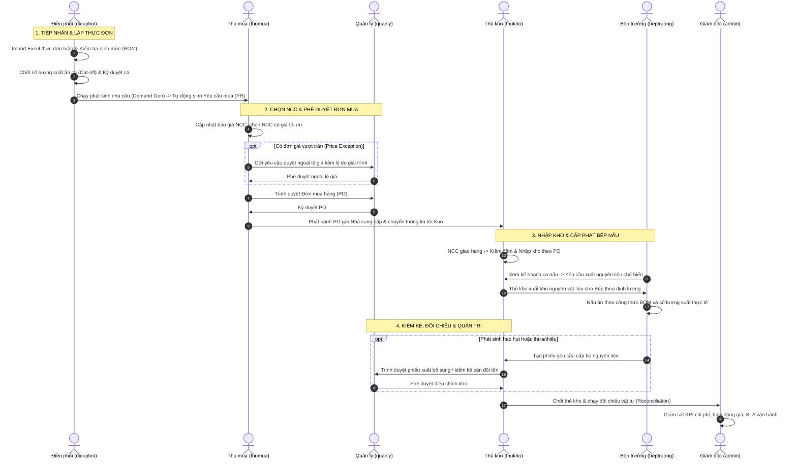

# CẨM NANG HƯỚNG DẪN SỬ DỤNG HỆ THỐNG THEO VAI TRÒ (ROLE-BASED USER GUIDE)
## HỆ THỐNG QUẢN LÝ BẾP ĂN CÔNG NGHIỆP — IPC MANAGEMENT SYSTEM

---

## MỤC LỤC
1. [Giới thiệu & Danh sách Tài khoản Truy cập](#1-giới-thiệu--danh-sách-tài-khoản-truy-cập)
2. [Sơ đồ Phân quyền & Luồng Phối hợp Nghiệp vụ (End-to-End Workflow)](#2-sơ-đồ-phân-quyền--luồng-phối-hợp-nghiệp-vụ)
3. [Hướng dẫn Sử dụng Chi tiết Theo Vai trò](#3-hướng-dẫn-sử-dụng-chi-tiết-theo-vai-trò)
   - [3.1. Vai trò: Giám đốc / Admin (`admin`)](#31-vai-trò-giám-đốc--admin-admin)
   - [3.2. Vai trò: Quản lý Vận hành (`quanly`)](#32-vai-trò-quản-lý-vận-hành-quanly)
   - [3.3. Vai trò: Điều phối Suất ăn & Thực đơn (`dieuphoi`)](#33-vai-trò-điều-phối-suất-ăn--thực-đơn-dieuphoi)
   - [3.4. Vai trò: Thu mua (`thumua`)](#34-vai-trò-thu-mua-thumua)
   - [3.5. Vai trò: Thủ kho (`thukho`)](#35-vai-trò-thủ-kho-thukho)
   - [3.6. Vai trò: Bếp trưởng (`beptruong`)](#36-vai-trò-bếp-trưởng-beptruong)
4. [Các Quy định Vận hành Quan trọng & SLA Phê duyệt](#4-các-quy-định-vận-hành-quan-trọng--sla-phê-duyệt)
5. [Câu hỏi Thường gặp & Xử lý Ngoại lệ (FAQ & Troubleshooting)](#5-câu-hỏi-thường-gặp--xử-lý-ngoại-lệ)

---

## 1. GIỚI THIỆU & DANH SÁCH TÀI KHOẢN TRUY CẬP

Hệ thống **IPC Management System** là giải pháp số hóa toàn diện quy trình cung ứng suất ăn công nghiệp: từ quản lý hợp đồng, thực đơn tuần, định lượng nguyên vật liệu (BOM), tính toán nhu cầu mua hàng (Purchase Request), quản lý báo giá và tạo đơn mua (PO), nhập - xuất - kiểm kê kho nguyên liệu, đến điều phối ca chế biến tại bếp và đối chiếu chi phí thực tế.

Hệ thống áp dụng cơ chế phân quyền dựa trên vai trò (RBAC) nghiêm ngặt. Dưới đây là danh sách các tài khoản demo đã được khởi tạo sẵn sàng phục vụ đào tạo và vận hành:

| STT | Vai trò (Role Code) | Tên vai trò | Tên tài khoản (Username) | Mật khẩu | Phạm vi quyền hạn chính |
|:---:|:---|:---|:---|:---:|:---|
| 1 | **ADMIN** | Giám đốc / Quản trị viên | `admin` | `123456` | Toàn quyền (`*`): Quản trị người dùng, phân quyền, cấu hình quy trình duyệt, xem log & KPI toàn công ty. |
| 2 | **MANAGER** | Quản lý Vận hành | `quanly` | `123456` | Phê duyệt chứng từ (PR, PO, chênh lệch giá, phiếu kho), giám sát chuỗi cung ứng, theo dõi cảnh báo chi phí. |
| 3 | **COORDINATOR** | Điều phối | `dieuphoi` | `123456` | Import thực đơn tuần, chốt suất ăn ca (Cut-off), chạy tính định lượng nguyên liệu (Demand Generation). |
| 4 | **PURCHASING** | Thu mua | `thumua` | `123456` | Tiếp nhận yêu cầu mua (PR), quản lý bảng giá NCC, lập đơn mua (PO), theo dõi nhà cung cấp giao hàng. |
| 5 | **WAREHOUSESTAFF** | Thủ kho | `thukho` | `123456` | Nhập kho theo PO, xuất kho cấp cho Bếp theo ca, kiểm kê định kỳ (Stocktake), lập phiếu điều chỉnh tồn. |
| 6 | **CHEF** | Bếp trưởng | `beptruong` | `123456` | Theo dõi kế hoạch ca nấu, định lượng BOM món, tiếp nhận nguyên liệu, lập phiếu xin cấp bù nguyên liệu phát sinh. |

> **Thông tin kỹ thuật:**
> - **Cổng Web Frontend:** [http://localhost:5173](http://localhost:5173)
> - **Cổng API Backend:** [http://localhost:5262](http://localhost:5262)
> - **Chính sách bảo mật:** Hệ thống giới hạn tần suất đăng nhập sai tối đa 5 lần/phút/IP để phòng chống tấn công dò mật khẩu.

---

## 2. SƠ ĐỒ PHÂN QUYỀN & LUỒNG PHỐI HỢP NGHIỆP VỤ

### 2.1. Ma trận Phân quyền Truy cập Menu & Chức năng

| Chức năng / Đường dẫn | Admin | Quản lý | Điều phối | Thu mua | Thủ kho | Bếp trưởng |
|:---|:---:|:---:|:---:|:---:|:---:|:---:|
| **Tổng quan / Bàn điều hành** (`/`) | ✅ Xem/Toàn quyền | ✅ Xem | ✅ Xem | ✅ Xem | ✅ Xem | ✅ Xem |
| **Thực đơn tuần** (`/weekly-menu`) | ✅ Toàn quyền | ✅ Xem/Sửa | ✅ **Thao tác chính** | ❌ Ẩn | ❌ Ẩn | ❌ Ẩn |
| **Điều phối suất ăn** (`/meal-orders`) | ✅ Toàn quyền | ✅ Giám sát | ✅ **Thao tác chính** | ❌ Ẩn | ❌ Ẩn | ❌ Ẩn |
| **Duyệt vận hành** (`/approvals`) | ✅ Toàn quyền | ✅ **Duyệt chính** | ❌ Ẩn | ❌ Ẩn | ❌ Ẩn | ❌ Ẩn |
| **Thu mua hàng** (`/purchasing`) | ✅ Toàn quyền | ✅ Xem/Duyệt | ❌ Ẩn | ✅ **Thao tác chính** | ❌ Ẩn | ❌ Ẩn |
| **Kho nguyên liệu** (`/warehouse`) | ✅ Toàn quyền | ✅ Giám sát | ✅ Tra cứu tồn | ❌ Ẩn | ✅ **Thao tác chính** | ❌ Ẩn |
| **Đối chiếu nguyên liệu** (`/reconciliation`) | ✅ Toàn quyền | ✅ Xem/Chốt | ❌ Ẩn | ❌ Ẩn | ✅ Tra cứu | ❌ Ẩn |
| **Bếp sản xuất** (`/chef-dashboard`) | ✅ Toàn quyền | ✅ Giám sát | ❌ Ẩn | ❌ Ẩn | ❌ Ẩn | ✅ **Thao tác chính** |
| **Báo cáo vận hành** (`/reports`) | ✅ Tất cả báo cáo | ✅ Tất cả | ✅ Báo cáo suất | ✅ Báo cáo giá | ✅ Báo cáo kho | ✅ Báo cáo chế biến |
| **Quản trị dữ liệu Master** (`/admin-data`) | ✅ **Duy nhất Admin** | ❌ Bị chặn | ❌ Bị chặn | ❌ Bị chặn | ❌ Bị chặn | ❌ Bị chặn |
| **Thiết lập quy trình duyệt** (`/admin/rules`) | ✅ **Duy nhất Admin** | ❌ Bị chặn | ❌ Bị chặn | ❌ Bị chặn | ❌ Bị chặn | ❌ Bị chặn |

---

### 2.2. Luồng Vận hành Chuỗi Cung ứng (End-to-End Workflow)

---

## 3. HƯỚNG DẪN SỬ DỤNG CHI TIẾT THEO VAI TRÒ

---

### 3.1. VAI TRÒ: GIÁM ĐỐC / ADMIN (`admin`)

#### Mục tiêu vai trò:
Kiểm soát toàn diện mọi thông tin hệ thống, quản lý danh mục dùng chung (nhân viên, khách hàng, nhà cung cấp, nguyên liệu, món ăn, định lượng BOM), cấu hình chính sách duyệt và SLA, kiểm tra nhật ký kiểm toán (Audit Log).

#### Các bước thao tác chính:

##### Bước 1: Quản trị Nhân viên & Cấp tài khoản
1. Truy cập menu **Quản trị dữ liệu** (`/admin-data`).
2. Chọn tab **Nhân viên & Phân quyền**:
   - Nhấn **Thêm nhân viên mới**: Điền Họ tên, Tên đăng nhập, Mật khẩu ban đầu và Vai trò tương ứng (`ADMIN`, `MANAGER`, `COORDINATOR`, `CHEF`, `WAREHOUSESTAFF`, `PURCHASING`).
   - Khóa/Mở khóa tài khoản: Nhấn nút bật/tắt `Kích hoạt` trên bảng danh sách.
   - Đặt lại mật khẩu (Reset Password): Chọn nhân viên cần đổi và nhập mật khẩu mới.

##### Bước 2: Thiết lập Quy trình Phê duyệt & Hạn mức SLA
1. Truy cập menu **Thiết lập quy trình duyệt** (`/admin/rules`).
2. Xem và điều chỉnh các quy tắc:
   - **Quy tắc duyệt yêu cầu mua sắm (PR/PO)**: Đặt ngưỡng giá trị (ví dụ: PO trên 50.000.000đ bắt buộc Giám đốc duyệt, dưới 50.000.000đ Quản lý được duyệt).
   - **Quy tắc duyệt ngoại lệ giá (Price Exception)**: Cảnh báo khi giá NCC mới vượt quá giá trần danh mục.
   - **Thời gian cam kết (SLA Time-to-Approve)**: Cấu hình số giờ cảnh báo khi chứng từ chờ duyệt bị quá hạn (vàng = sắp quá hạn, đỏ = đã vi phạm SLA).

##### Bước 3: Giám sát Bàn Điều Hành & KPI
1. Truy cập menu **Tổng quan** (`/`).
2. Xem các chỉ số:
   - Số ca đang chạy trong ngày, tỷ lệ hoàn thành chế biến.
   - Cảnh báo tồn kho dưới mức an toàn (Safety Stock).
   - Số chứng từ đang nằm trong hàng đợi duyệt chờ xử lý.

---

### 3.2. VAI TRÒ: QUẢN LÝ VẬN HÀNH (`quanly`)

#### Mục tiêu vai trò:
Chịu trách nhiệm phê duyệt mọi chứng từ phát sinh trong chuỗi vận hành (Yêu cầu mua, Đơn mua, Phiếu xuất bù, Phiếu điều chỉnh tồn kho), kiểm soát chi phí thực phẩm (Food Cost) và giải quyết các vướng mắc giữa các bộ phận.

#### Các bước thao tác chính:

##### Bước 1: Xử lý Hàng đợi Phê duyệt
1. Truy cập menu **Duyệt vận hành** (`/approvals`).
2. Quan sát bảng danh sách các chứng từ chờ duyệt được phân loại theo thẻ:
   - **Yêu cầu mua sắm (PR)**: Kiểm tra mã tuần, khách hàng, danh sách nguyên liệu và tổng dự toán.
   - **Ngoại lệ giá (Price Exception)**: So sánh giá NCC báo với giá trần chuẩn, xem lý do giải trình từ bộ phận Thu mua (ví dụ: thị trường khan hiếm, biến động mùa vụ).
   - **Phiếu kho (Receipt/Issue/Adjustment)**: Các yêu cầu xuất bù cho bếp hoặc cân đối hao hụt kho.
3. Thao tác phê duyệt:
   - Nhấn **Xem chi tiết** để mở Drawer xem từng dòng mặt hàng.
   - Nhấn nút xanh **Phê duyệt** để chuyển trạng thái chứng từ sang hợp lệ.
   - Nếu từ chối: Nhấn nút đỏ **Từ chối**, một cửa sổ popup sẽ xuất hiện **bắt buộc nhập lý do từ chối** để người lập biết căn cứ chỉnh sửa lại.

##### Bước 2: Theo dõi Cảnh báo Chi phí & SLA
1. Bảng duyệt tự động gắn nhãn huy hiệu thời gian (Due Badge):
   - Nhãn xanh: Trong thời hạn SLA.
   - Nhãn vàng: Sắp đến hạn xử lý.
   - Nhãn đỏ chớp: Đã vi phạm SLA cam kết, cần xử lý ngay lập tức.
2. Kiểm tra tab **Báo cáo vận hành** (`/reports`): Xem báo cáo biến động giá nguyên liệu (Price Variance Report) theo từng NCC và theo nhóm món ăn.

---

### 3.3. VAI TRÒ: ĐIỀU PHỐI SUẤT ĂN & THỰC ĐƠN (`dieuphoi`)

#### Mục tiêu vai trò:
Lập và quản lý kế hoạch thực đơn cho từng tuần làm việc, chốt số lượng suất ăn với từng đối tác/khách hàng, tính toán lượng nguyên liệu cần thiết và đẩy lệnh sang kho/thu mua.

#### Các bước thao tác chính:

##### Bước 1: Quản lý Thực đơn Tuần
1. Truy cập menu **Thực đơn tuần** (`/weekly-menu`).
2. Chọn tuần làm việc trên bộ lọc phía trên (ví dụ: `20/07/2026 - 26/07/2026`).
3. Khởi tạo/cập nhật thực đơn:
   - Cách 1: Nhấn **Tải file mẫu Excel**, điền danh sách món theo bữa (Sáng/Trưa/Tối) và ngày, sau đó nhấn **Nhập Excel** để hệ thống tự động đọc và chuẩn hóa.
   - Cách 2: Nhấn **Chỉnh sửa thực đơn** để gán trực tiếp món ăn trên giao diện ma trận tuần.
4. Kiểm tra tỷ lệ dinh dưỡng, phân bổ món mặn/chay và chi phí dự kiến cho từng suất ăn.

##### Bước 2: Điều phối & Chốt Suất ăn Ca (Cut-off)
1. Truy cập menu **Điều phối đơn** (`/meal-orders`).
2. Chọn ca làm việc: **Ca sáng** hoặc **Ca chiều**.
3. Xem danh sách các khách hàng/công ty:
   - Kiểm tra số lượng suất đăng ký theo hợp đồng.
   - Nhập số lượng phát sinh thực tế (tăng hoặc giảm suất do khách hàng báo bổ sung trước giờ Cut-off).
4. Thực hiện chốt ca:
   - Nhấn nút **Khóa đơn ca** để cố định số lượng suất, ngăn không cho sửa đổi tự do.
   - Nhấn **Ký duyệt chốt ca** để hoàn tất việc chuyển lệnh xuống Bếp và Kho.

##### Bước 3: Chạy Phát sinh Nhu cầu Vật tư (Demand Generation)
1. Quay lại màn hình Thực đơn tuần, cuộn xuống khu vực **Kế hoạch sản xuất & Định lượng**.
2. Nhấn nút **Tính toán nhu cầu nguyên liệu**:
   - Hệ thống sẽ nhân số suất ăn đã chốt với định lượng trong BOM của từng món ăn.
   - Tự động đối chiếu với số lượng tồn kho khả dụng hiện có.
   - Với lượng nguyên liệu thiếu: Hệ thống tự động sinh **Yêu cầu mua hàng (Purchase Request)** và gửi thẳng sang phân hệ của Thu mua.

---

### 3.4. VAI TRÒ: THU MUA (`thumua`)

#### Mục tiêu vai trò:
Tiếp nhận các Yêu cầu mua hàng (PR) từ khâu Điều phối, so sánh giá của các nhà cung cấp được duyệt, lựa chọn phương án mua tối ưu chi phí và lập Đơn mua hàng (PO) chính thức.

#### Các bước thao tác chính:

##### Bước 1: Tiếp nhận Yêu cầu Mua hàng (PR)
1. Truy cập menu **Thu mua** (`/purchasing`).
2. Tại bảng **Yêu cầu mua sắm**, lọc theo trạng thái `Chờ xử lý` hoặc theo mã tuần.
3. Nhấp vào từng yêu cầu để xem chi tiết danh sách nguyên liệu, số lượng cần mua, đơn vị tính và ngày cần hàng.

##### Bước 2: Quản lý Báo giá & Phân bổ Nhà cung cấp
1. Chuyển sang phần **So sánh báo giá nhà cung cấp**:
   - Hệ thống tự động liệt kê các nhà cung cấp có mặt hàng tương ứng.
   - Hiển thị đơn giá chào thầu mới nhất, thời gian giao hàng và đánh giá chất lượng NCC.
   - Hệ thống tự động gợi ý NCC có giá thấp nhất đáp ứng đúng quy cách.
2. Xử lý trường hợp vượt giá trần:
   - Nếu đơn giá mua cao hơn đơn giá định mức trong hợp đồng, hệ thống sẽ đánh dấu cảnh báo màu cam (Price Exception).
   - Nhấn **Lập đề xuất ngoại lệ giá**, nhập lý do giải trình ngắn gọn và gửi lên Quản lý phê duyệt.

##### Bước 3: Phát hành Đơn mua hàng (Purchase Order - PO)
1. Sau khi đã chọn xong NCC cho các mặt hàng, nhấn nút **Tạo đơn mua hàng (PO)**.
2. Điền các thông tin: Địa điểm kho nhận, ngày giờ giao dự kiến, điều khoản thanh toán.
3. Nhấn **Trình duyệt PO** để gửi tới Quản lý.
4. Sau khi Quản lý duyệt, trạng thái PO chuyển sang `Đã duyệt` (Approved). Nhân viên Thu mua nhấn **Xuất file PO (PDF/Excel)** hoặc gửi email thông báo cho NCC giao hàng.

---

### 3.5. VAI TRÒ: THỦ KHO (`thukho`)

#### Mục tiêu vai trò:
Tiếp nhận hàng giao từ NCC, kiểm đếm số lượng, chất lượng và tạo phiếu nhập kho; cấp phát nguyên liệu cho Bếp theo ca nấu; kiểm kê định kỳ và báo cáo biến động thẻ kho.

#### Các bước thao tác chính:

##### Bước 1: Nhập kho theo Đơn Mua Hàng (PO Inbound)
1. Truy cập menu **Kho nguyên liệu** (`/warehouse`).
2. Chọn tab **Nhập kho**:
   - Tìm kiếm theo số PO hoặc tên Nhà cung cấp.
   - Nhấn **Nhận hàng**: Kiểm đếm số lượng thực nhận so với số lượng ghi trên PO.
   - Nếu phát hiện hàng hỏng/kém phẩm chất: Ghi nhận số lượng từ chối nhận kèm biên bản.
   - Nhấn **Xác nhận nhập kho**: Tồn kho hệ thống tự động cộng tăng ngay lập tức.

##### Bước 2: Xuất kho Cấp phát cho Bếp (Outbound)
1. Tại màn hình Kho, chọn tab **Xuất kho**:
   - Chọn ca sản xuất (ví dụ: Ca trưa ngày 24/07).
   - Danh sách nguyên liệu cần xuất đã được hệ thống tạo sẵn dựa trên số suất ăn đã chốt từ khâu Điều phối.
2. Kiểm tra hàng xuất thực tế tại kho (lô hàng, hạn sử dụng theo nguyên tắc FEFO - hết hạn trước xuất trước).
3. Nhấn **Xác nhận xuất kho**: In phiếu giao nhận nguyên liệu để Bếp trưởng ký nhận.

##### Bước 3: Kiểm kê Kho & Điều chỉnh Tồn kho (Stocktake)
1. Chọn tab **Kiểm kê & Điều chỉnh**:
   - Nhấn **Tạo đợt kiểm kê mới**: Chọn danh mục kiểm (Tươi sống, Gia vị, Đóng hộp...).
   - Nhập số lượng đếm thực tế (Actual Qty). Hệ thống tự tính chênh lệch so với số lượng sổ sách (System Qty).
   - Với các chênh lệch vượt ngưỡng dung sai cho phép (Tolerance), bắt buộc điền ghi chú nguyên nhân (hao hụt tự nhiên, đổ vỡ, thừa do cân lẻ).
2. Nhấn **Gửi phê duyệt điều chỉnh**: Phiếu được chuyển tới Quản lý để ký duyệt cân đối kho.

---

### 3.6. VAI TRÒ: BẾP TRƯỞNG (`beptruong`)

#### Mục tiêu vai trò:
Nắm bắt kế hoạch chế biến trong từng ca, chuẩn bị món ăn theo đúng công thức định lượng (BOM), tiếp nhận nguyên liệu từ kho và báo cáo kịp thời sự cố thiếu hụt nguyên liệu tại bếp.

#### Các bước thao tác chính:

##### Bước 1: Xem Kế hoạch Ca Sản xuất
1. Truy cập menu **Bếp trưởng** (`/chef-dashboard`).
2. Xem thông tin đầu ca:
   - Tổng số suất ăn cần phục vụ trong ca.
   - Danh sách các món ăn chính, món phụ, canh, món tráng miệng.
   - Thời gian dự kiến hoàn thành chế biến để kịp giờ chia suất.

##### Bước 2: Tra cứu Công thức & Định lượng (Recipe BOM)
1. Nhấp vào tên từng món ăn trên danh sách chế biến để xem chi tiết công thức (BOM).
2. Màn hình hiển thị chính xác định lượng từng thành phần nguyên liệu (thịt, rau, gia vị...) tính trên 1 suất ăn và nhân tổng số suất của ca.
3. Bếp trưởng căn cứ vào định lượng này để phân công các bếp phụ sơ chế và nấu nướng đạt chuẩn vị và định mức dinh dưỡng.

##### Bước 3: Lập Yêu cầu Cấp bù Nguyên liệu Phát sinh
1. Trong quá trình chế biến, nếu phát sinh sự cố (nguyên liệu hỏng bất thường khi mở bao bì, hoặc khách hàng tăng suất gấp):
   - Tại màn hình Bếp, nhấn nút **Yêu cầu cấp bù nguyên vật liệu**.
   - Chọn nguyên liệu cần thêm, nhập số lượng và chọn lý do (Hao hụt sơ chế / Đổi món / Bổ sung suất).
   - Nhấn **Gửi yêu cầu**: Phiếu lập tức xuất hiện tại màn hình của Thủ kho để xuất gấp và thông báo cho Quản lý theo dõi.

---

## 4. CÁC QUY ĐỊNH VẬN HÀNH QUAN TRỌNG & SLA PHÊ DUYỆT

1. **Thời điểm khóa số liệu (Cut-off Time):**
   - Suất ăn ca trưa phải được chốt trước **08:30 sáng** cùng ngày.
   - Suất ăn ca chiều/tối phải được chốt trước **14:00 chiều** cùng ngày.
   - Sau thời điểm này, nút điều chỉnh số lượng sẽ bị khóa, mọi thay đổi phải có xác nhận đặc biệt từ Quản lý.

2. **Quy định về Duyệt Ngoại lệ Giá (Price Exception Policy):**
   - Đơn giá mua vượt quá 5% so với giá trần danh mục: Thu mua bắt buộc phải xin tối thiểu 2 báo giá cạnh tranh trước khi trình duyệt.
   - Thời gian xử lý duyệt ngoại lệ giá cam kết không quá **2 giờ làm việc** để tránh trễ hạn giao hàng.

3. **Nguyên tắc Xuất Kho FEFO (First Expired, First Out):**
   - Thủ kho luôn phải ưu tiên xuất các lô hàng có hạn sử dụng ngắn hơn trước nhằm giảm thiểu tối đa rủi ro nguyên liệu quá hạn.

---

## 5. CÂU HỎI THƯỜNG GẶP & XỬ LÝ NGOẠI LỆ (FAQ & TROUBLESHOOTING)

### Q1: Tôi đăng nhập bị báo lỗi "Tài khoản hoặc mật khẩu không đúng"?
- **Nguyên nhân:** Nhập sai ký tự hoặc tài khoản bị khóa do nhập sai liên tiếp quá 5 lần.
- **Cách xử lý:** Đảm bảo nhập đúng tên tài khoản viết thường không dấu (ví dụ: `quanly`, `dieuphoi`), mật khẩu mặc định là `123456`. Chờ 1 phút nếu bị dính giới hạn tần suất (Rate Limit 429). Nếu vẫn không được, liên hệ Admin để kiểm tra trạng thái kích hoạt trong bảng nhân viên.

### Q2: Tại sao tài khoản của tôi không thấy menu "Quản trị dữ liệu" hoặc "Duyệt vận hành"?
- **Nguyên nhân:** Hệ thống áp dụng phân quyền theo vị trí việc làm. Menu `Quản trị dữ liệu` chỉ mở duy nhất cho vai trò **Giám đốc / Admin**. Menu `Duyệt vận hành` chỉ dành cho **Quản lý** và **Admin**.
- **Cách xử lý:** Nếu bạn kiêm nhiệm thêm chức năng, vui lòng liên hệ Admin để được cấp thêm quyền trong hệ thống.

### Q3: Sau khi Import Excel Thực đơn tuần, làm sao biết dữ liệu đã hợp lệ?
- **Nguyên nhân:** File Excel có thể chứa tên món hoặc mã nguyên liệu chưa tồn tại trong danh mục master.
- **Cách xử lý:** Sau khi tải file lên, hệ thống sẽ mở màn hình Preview kiểm tra tính đúng đắn. Các ô vi phạm định dạng hoặc thiếu mã nguyên liệu sẽ có màu cảnh báo đỏ. Bạn chỉ cần sửa lại theo đúng file mẫu và tải lại.

### Q4: Bếp phát hiện thiếu gia vị trong lúc đang nấu thì làm thế nào?
- **Cách xử lý:** Bếp trưởng vào màn hình `Bếp trưởng` (`/chef-dashboard`), nhấn nút `Yêu cầu cấp bù nguyên vật liệu`, chọn mặt hàng và số lượng cần thêm. Thủ kho sẽ thấy ngay lập tức phiếu xuất bổ sung để xuất hàng phục vụ kịp thời.

---

*Tài liệu được biên soạn và chuẩn hóa cho Hệ thống IPC Management System — Cập nhật Tháng 09/2026.*
