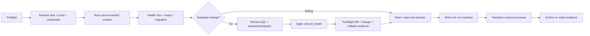

# Shipyard operations contract

## Mục đích và ownership

Đây là runbook canonical cho mọi lần chạy local, E2E, browser evidence và database
verification của IPCManagement. GSD sở hữu plan/state/verification; Shipyard chỉ sở hữu
runtime orchestration và evidence. Không tạo thêm thư mục run tuỳ ý.

Có hai lớp phải giữ riêng:

| Lớp | Vị trí | Nhiệm vụ | Quyền xoá |
|---|---|---|---|
| Project profile | `IPCManagement/shipyard/` | Profile, hook và manifest được review cùng source | Chỉ qua thay đổi repo |
| Harness checkout | `D:/Kì 7/PRN222 Doanh Nghiệp/shipyard/` | Engine dashboard/lane generic | Chỉ owner harness |
| Generated lane | `D:/Kì 7/PRN222 Doanh Nghiệp/shipyard-lanes/laneN/` | Clone cô lập theo lane | Chỉ `lane-remove`, không xoá tay |
| Project evidence | `IPCManagement/.artifacts/shipyard-live/<run-id>/` | Screenshot, API-after-action, console, performance, manifest | Archive theo retention |

`shipyard-lanes/lane1` là lane được bảo vệ. Không reset, seed, migrate, restore, import
hoặc xoá lane này trong quy trình audit.

## Lifecycle một run



Mỗi run phải có một `run-id` duy nhất và kết thúc bằng manifest. Run bị lỗi vẫn phải ghi
`status: failed`, lỗi, process ownership và bước teardown; không tạo run con để che lỗi.

## Canonical topology

| Profile | Database | API | Frontend | Mục đích |
|---|---|---:|---:|---|
| `protected` | `ipc_lane1` | 8001 | 3001 | Chỉ đọc/smoke không mutation |
| `mutation` | `ipc_lane9` | 8010 | 3010 | Migration và E2E mutation có checkpoint |
| `template` | `ipc_e2e_template` | 8010 | 3010 | E2E/audit có dữ liệu kiểm soát; không dùng để suy ra production |

Port phải lấy từ manifest/environment của run. Không hardcode port hoặc database trong
runner; `health/ready` phải chứng minh đúng database và migration history.

Credential chỉ lấy từ environment/credential store đã xoay. Không ghi mật khẩu, token,
connection string hoặc cookie vào manifest, log, screenshot hay tài liệu.

## Database synchronization gate

Áp dụng cho mọi thay đổi entity, migration, seed, query projection có ảnh hưởng schema,
lineage hoặc data-integrity:

1. **Select lane**: xác nhận target là `ipc_lane9` hoặc template được phê duyệt; từ chối
   `ipc_lane1` trước khi mở connection.
2. **Preflight read-only**: chụp migration history, model pending check, row counts,
   duplicate/ambiguous groups, foreign-key compatibility và backup/checkpoint ID.
3. **Review SQL**: SQL phải sinh từ checkout hiện tại; soi `USE`, `CREATE/DROP DATABASE`,
   `DROP TABLE`, UPDATE/DELETE/backfill và index/constraint names. Migration additive,
   idempotent và không tự suy đoán lineage.
4. **Apply**: dừng writer ngoài run, áp dụng một lần trên lane đã khóa; không để nhiều API
   instance tự migrate.
5. **Postflight**: chạy lại preflight, `dotnet ef migrations has-pending-model-changes`,
   health readiness, constraint/index checks và targeted regression. So sánh row counts và
   lineage trước/sau; mọi thay đổi ngoài dự kiến là NO-GO.
6. **Rollback evidence**: ghi rollback khả dụng. Migration có dữ liệu append-only không
   được down-destructively; dùng feature-off/checkpoint theo `LIFECYCLE-MIGRATION-RUNBOOK`.
7. **Closeout**: cập nhật `docs/EVIDENCE-INDEX.md`, `.planning/.../STATE.md`, rồi chỉ giữ
   trạng thái hiện hành trong `MEMORY.md`.

Không coi “migration command thành công” là đồng bộ hoàn tất. Đồng bộ chỉ PASS khi có đủ
preflight → SQL review → apply → postflight → evidence.

## Artifact contract

```text
.artifacts/shipyard-live/<run-id>/
  manifest.json              # bắt buộc, một file/run
  screenshots/               # headed browser cuối mỗi scenario
  api/                       # request/response sau action
  browser/                   # console, page errors, failed requests
  performance/               # CLS, long task, timing
  db/                        # preflight/postflight, không có secret
```

Các thư mục lịch sử hiện tại như `.artifacts/browser-use-*`, `.artifacts/e2e*`,
`.artifacts/*-debug`, log root và zip là **legacy evidence**. Không dùng chúng làm output
mới; chỉ trỏ hash authoritative từ `docs/EVIDENCE-INDEX.md`.

## Teardown, archive và cleanup

- Chỉ dừng process có PID do run hiện tại tạo; không kill toàn bộ Chrome/MySQL.
- Khi run đóng, chuyển evidence đã được hash vào retention phù hợp; giữ authoritative
  evidence và xóa cache/build/log rỗng theo inventory đã review.
- `shipyard-lanes/laneN` chỉ được thu hồi bằng harness owner sau khi lane không còn lock,
  process, DB checkpoint hoặc evidence tham chiếu.
- Harness độc lập ngoài project không được copy vào repo và không được repo script tự sửa.
  Nếu cần đổi engine, sửa ở harness repo rồi cập nhật compatibility note/manifest.
- Không archive/xóa khi chưa có dry-run inventory và xác nhận không có evidence pointer,
  migration rollback, credential-rotation record hoặc process lock đang tham chiếu.

## Các thao tác bị cấm

`git reset --hard`, `git clean`, xoá recursive lane; reset/seed/restore/import để làm test;
chạy SQL không review; migration vào `ipc_lane1`; hardcode credential; dùng empty/error
table để kết luận browser PASS; và tạo thư mục artifact ngoài contract.

## Checklist đóng run

- [ ] `run-id`, lane, DB, ports và source commit khớp manifest.
- [ ] `/health/live` và `/health/ready` pass; ready xác nhận DB/migrations.
- [ ] DB preflight/postflight và SQL review có trong evidence.
- [ ] FE control → API → DB transition → FE reload đã được kiểm tra nếu có mutation.
- [ ] Screenshot, API-after-action, console/page errors, CLS/long-task đã lưu.
- [ ] Teardown chỉ chạm process của run; runtime không còn orphan.
- [ ] Evidence index, STATE và MEMORY được đồng bộ; không có secret.
