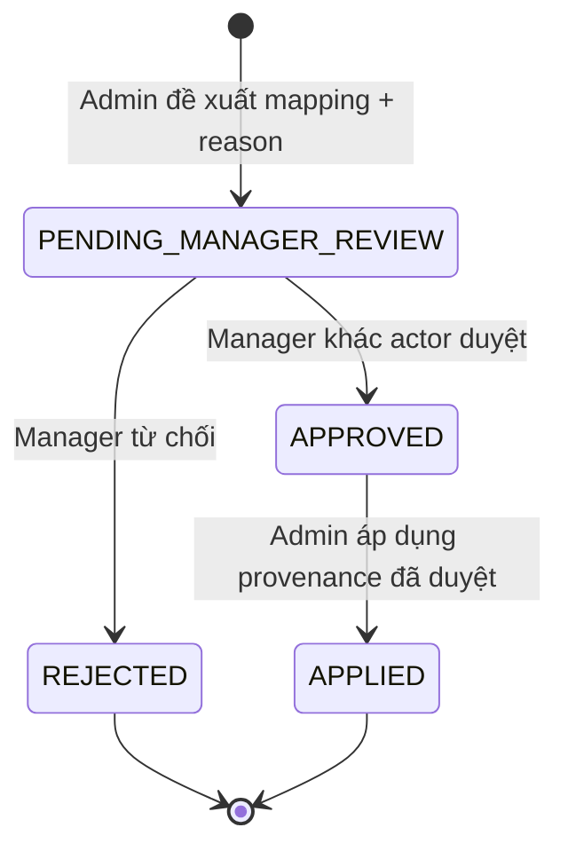

# ADR-0003: Đối soát provenance legacy theo work object duyệt kép

- Status: Accepted
- Date: 2026-08-09

## Bối cảnh

Các `InventoryIssueLine` và `InventoryReturnLine` lịch sử có thể thiếu source-line
provenance. Một issue line có nhiều demand line cùng ingredient/unit không thể được
map bằng tên nguyên liệu, issue header hay candidate đầu tiên. Nếu lấp `NULL` tự
động, reconciliation có thể nhìn khớp trong khi số lượng thực tế đã bị gán nhầm.

## Quyết định

Mỗi dòng legacy được xử lý như một **Legacy Lineage Disposition** riêng:

- Issue line chỉ có thể map đến `MaterialRequestLine` thuộc chính material request,
  cùng ingredient và unit.
- Return line chỉ có thể map đến `InventoryIssueLine` thuộc chính issue, cùng
  ingredient và unit.
- `APPLIED` chỉ ghi FK provenance nullable đã được review. Nó không sửa quantity,
  status, kitchen acknowledgement, stock movement, current stock hay audit cũ.
- `REJECTED` giữ dòng ở reconciliation exception; không có fallback hay auto-map.
- Mỗi transition mang `commandId`, audit/lifecycle transition/outbox và idempotent
  replay. Hai proposal active cho cùng legacy line bị database fence chặn.
- Đề xuất/dừng/áp dụng đều cần reason. Creator không được duyệt proposal của mình.

## Hệ quả

Đối soát legacy trở thành bằng chứng có actor, time và state thay vì một backfill
SQL không có review. Shadow reconciliation chỉ coi một dòng resolved sau `APPLIED`.
Phase 6 vẫn phải chứng minh zero-reader/zero-writer và không được xóa compatibility
path chỉ vì một proposal đã được tạo hoặc duyệt.
