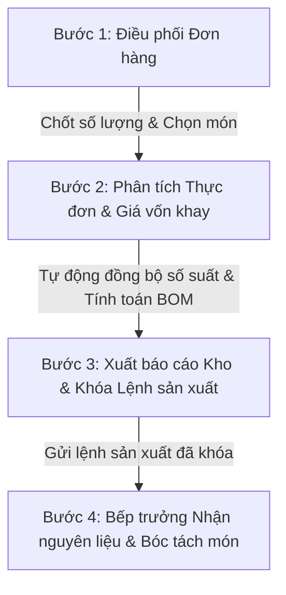

# IPC Management System - Frontend App

Hệ thống quản lý bếp ăn công nghiệp (Industrial Portions & Catering Management) - Phân hệ Frontend được xây dựng bằng React, TypeScript, Redux Toolkit và Tailwind CSS v4.

---

## 1. Hướng Dẫn Cách Chạy (Dành Cho Windows & PowerShell)

Do hệ điều hành Windows mặc định chặn thực thi các file script PowerShell (`.ps1`), việc chạy lệnh `npm` trực tiếp có thể gặp lỗi bảo mật. Vui lòng sử dụng các cách chạy sau:

### Cách 1: Sử dụng tệp chạy trực tiếp `npm.cmd` (Khuyên dùng)
Lệnh này chạy chương trình thực thi Windows `.cmd` không bị ảnh hưởng bởi chính sách bảo mật PowerShell.

**Chạy từ thư mục gốc của dự án (IPCManagement):**
```powershell
npm.cmd run fe
```

**Chạy khi bạn đang đứng ở thư mục con `frontend`:**
```powershell
npm.cmd run dev
```

### Cách 2: Tạm thời Bypass Execution Policy trên PowerShell
Nếu bạn muốn sử dụng lệnh `npm` tiêu chuẩn, hãy chạy lệnh dưới đây để mở quyền trong phiên làm việc hiện tại của terminal:
```powershell
Set-ExecutionPolicy -ExecutionPolicy RemoteSigned -Scope Process
npm run fe
```

### Cách 3: Chạy thông qua Command Prompt (cmd)
```powershell
cmd /c npm run fe
```

Sau khi khởi động thành công, bạn mở trình duyệt và truy cập: **`http://localhost:5173`**

---

## 2. Quy Trình / Luồng Chạy Của Hệ Thống (Workflow)

Hệ thống hoạt động theo một luồng xử lý khép kín gồm 4 bước từ khâu Nhận đơn hàng -> Tính định lượng & Giá vốn -> Xuất kho -> Báo bếp nấu:



### Bước 1: Người Điều Phối Nhận & Chốt Đơn Hàng (Meal Order Dashboard)
* **Đường dẫn:** `/meal-orders` (Mục **"Điều phối & Chốt đơn"**)
* **Thao tác:**
  1. Người điều phối chọn **Thứ trong tuần** và **Ca làm việc** (Ca Sáng / Ca Chiều).
  2. Hệ thống tải lên danh sách khách hàng. Người điều phối có thể chọn **Món ăn cụ thể** cho từng khách hàng (dựa trên thực đơn đề xuất nhưng cho phép đổi món).
  3. Nhập số lượng **Suất dự kiến**.
  4. Nhấn **"Khóa & Chốt Đơn Hàng"**. Trạng thái của ca đó sẽ chuyển sang **🔒 Đã khóa** và số lượng dự kiến sẽ được sao chép sang **Suất chốt thực tế**.

### Bước 2: Thực Đơn Tuần & Phân Tích Định Lượng Suất Ăn (Weekly Menu Page)
* **Đường dẫn:** `/weekly-menu` (Mục **"Thực đơn tuần & Định lượng"**)
* **Thao tác:**
  1. Dietitian/Nhân viên lên thực đơn (chọn món) cho từng ngày trong tuần.
  2. Số lượng suất ăn cho mỗi ngày/ca được **tự động đồng bộ (cộng dồn)** từ các đơn hàng của khách hàng đã chốt ở Bước 1.
  3. **Phân Tích Giá Vốn 1 Khay Ăn (Portion Analysis):**
     * Chọn món ăn cụ thể để phân tích.
     * Hệ thống tự động tính toán **Giá vốn nguyên liệu cấu thành 1 khay** dựa trên định lượng thực tế (đã nhân tỉ lệ hao hụt sơ chế và tỉ lệ đơn giá) $\times$ giá nhà cung cấp tốt nhất.
     * Hiển thị chỉ số **Tỷ lệ giá vốn (Food Cost %)** và **Biên lợi nhuận gộp tạm tính** trên 1 khay ăn với cảnh báo màu sắc (Xanh: Lời tốt, Vàng: Sát biên, Đỏ: Nguy cơ lỗ).

### Bước 3: Xuất Báo Cáo Gửi Kho (Warehouse Dispatch)
* **Thao tác:**
  1. Tại bảng tổng hợp định lượng nguyên liệu cuối trang **Thực đơn tuần & Định lượng**, hệ thống tự động cộng dồn toàn bộ lượng nguyên liệu cần mua cho cả tuần.
  2. Nhấn nút **"Xuất Báo Cáo Gửi Kho"** để kết xuất danh sách nguyên liệu thô (tên, số lượng thực tế cần xuất/nhập kho, nhà cung cấp đề xuất, giá và thành tiền) phục vụ việc gửi kho đi mua.

### Bước 4: Nhận Lệnh & Thực Thi Tại Bếp (Head Chef Dashboard)
* **Đường dẫn:** `/chef-dashboard` (Mục **"Bếp trưởng & Bóc tách"**)
* **Thao tác:**
  1. Bếp trưởng chọn **Thứ trong tuần** và **Ca làm việc** muốn nấu.
  2. Hệ thống tự động đồng bộ kế hoạch sản xuất từ đơn hàng đã chốt ở Bước 1.
  3. **Nhãn Trạng thái Lệnh:**
     * Nếu ca đó chưa được chốt ở Bước 1, hiển thị nhãn **"BẢN DỰ THẢO - CHƯA CHỐT"** (nguyên liệu ở dạng chờ chốt, vô hiệu hóa ký nhận).
     * Nếu ca đó đã được khóa, hiển thị nhãn **"LỆNH SẢN XUẤT CHÍNH THỨC"** (nguyên liệu ở dạng chờ nhận).
  4. Bếp trưởng tiến hành nhận nguyên liệu thô thực tế từ kho bàn giao sang và tích chọn **Ký nhận** trên danh sách checklist.
  5. Bếp trưởng theo dõi bảng **Bóc tách món ăn** để biết chính xác số lượng nguyên liệu thô cần xuất ra cho từng món nấu cụ thể (ví dụ: cần bao nhiêu kg thịt gà cho món *Cơm gà xối mỡ*).
  6. Ghi nhận các yêu cầu bổ sung nguyên liệu thiếu hoặc bàn giao trả lại nguyên liệu thừa cuối ca.

---

## 3. Các Lệnh Build Dự Án

Để kiểm tra tính toàn vẹn của mã nguồn và build gói sản phẩm chạy production:
```powershell
# Từ thư mục gốc của dự án (IPCManagement)
npm.cmd run build -w frontend
```

Hoặc nếu đang đứng trong thư mục `frontend`:
```powershell
npm.cmd run build
```
Lệnh này sẽ chạy kiểm tra kiểu dữ liệu TypeScript (`tsc -b`) và đóng gói mã nguồn tĩnh bằng Vite/Rolldown.
